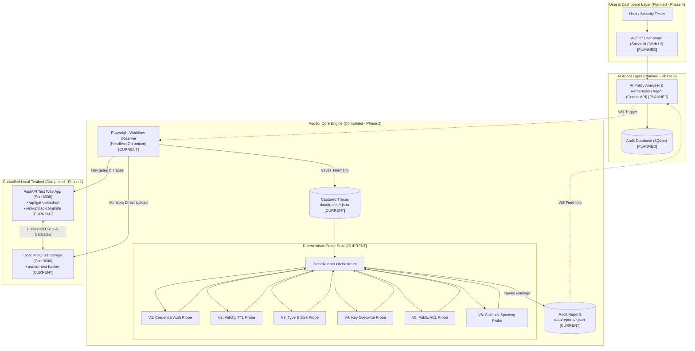
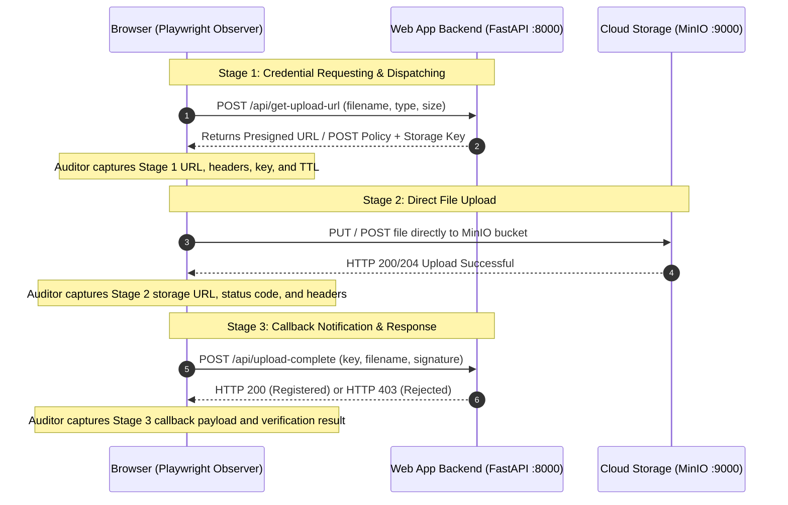

# Scaling Direct Cloud Upload Auditing via Autonomous AI Agents

**Final-Year B.Tech Major Project**  
**Academic Year:** 2026  
**Status:** Phase 1 and Phase 2 Completed & Verified (Phases 3 and 4 are Planned)  

---

## 1. Project Overview

Many modern web applications allow users to upload files (such as profile photos, documents, and videos) directly to cloud storage services like Amazon S3, Google Cloud Storage, or Azure Blob Storage. Instead of sending the file to the web server first, the server generates a temporary **presigned URL or upload token**. The user’s browser then uploads the file directly to the cloud storage bucket.

While direct cloud upload improves upload speed and reduces the load on backend servers, it introduces serious security risks if access controls, expiration times, file types, or callbacks are misconfigured.

Our project, **"Scaling Direct Cloud Upload Auditing via Autonomous AI Agents"**, aims to automate the security testing of these direct cloud upload workflows. We built a controlled local test environment, an automated browser observer, and deterministic security probes to test for common vulnerabilities. In future phases, we will add autonomous AI agents using Large Language Models (LLMs) to intelligently analyze policies and suggest fixes.

---

## 2. Objectives

1. **Build a Controlled Local Testbed (Phase 1 - Completed):**  
   Create a local web application and S3-compatible cloud storage setup that can simulate both vulnerable and secure direct upload configurations.

2. **Automate Workflow Observation (Phase 2 Part 1 - Completed):**  
   Use browser automation (Playwright) to visit the upload page, perform test uploads, and capture all network requests and responses across the upload process.

3. **Develop Deterministic Security Probes (Phase 2 Part 2 - Completed):**  
   Build automated Python probe scripts to test for six specific direct upload vulnerability categories (V1 to V6) and generate structured JSON audit reports.

4. **Add AI Agents for Policy & Risk Analysis (Phase 3 - Planned):**  
   Integrate Google Gemini API to analyze complex cloud storage policies, evaluate edge cases, and generate code remediation suggestions for developers.

5. **Create a Dashboard and Evaluate Performance (Phase 4 - Planned):**  
   Build a user dashboard to view audit findings and measure detection accuracy, speed, and time saved compared to manual testing.

---

## 3. Problem Statement

Existing research identified six major vulnerability categories in websites that use direct-to-cloud file uploads. However, discovering these vulnerabilities in real applications still depends mostly on **manual penetration testing, browser proxy inspection (such as Burp Suite), and custom one-off scripts**.

This creates three main challenges:
- **Manual testing takes too much time:** Security testers must manually inspect JavaScript, capture presigned URLs, decode tokens, and test requests one by one.
- **Standard vulnerability scanners miss direct uploads:** Traditional automated tools only scan standard web server traffic. They do not trace the direct browser-to-cloud upload step or check post-upload webhooks.
- **Misconfigurations are easy to overlook:** Developers frequently set upload tokens with long validity windows, forget file size restrictions, use predictable filenames, or leave callback endpoints unprotected.

---

## 4. Research Motivation

- **Direct uploads are everywhere:** Almost all modern SaaS applications, social networks, and file-sharing portals use direct cloud uploads to handle large files efficiently.
- **Multi-party security boundary:** The direct upload process involves three separate parties: the client browser, the application backend, and the cloud storage service. A mistake in any of these three parts can lead to data leaks or unauthorized file uploads.
- **Need for scalable testing:** By automating browser observation and probe testing, security audits can be completed in seconds instead of hours, making regular security audits practical for development teams.

---

## 5. Research Gap

```
Research Paper Baseline
   ↓ (Identified 6 vulnerability categories V1–V6)
Current Limitation
   ↓ (Relies on manual testing and interactive proxy interception)
Our Project's Contribution
   ↓ (Automates observation + deterministic probing + future AI analysis)
```

| Dimension | Previous Manual / Semi-Automated Approach | Our Proposed Approach |
| :--- | :--- | :--- |
| **Workflow Capture** | Manually opening browser DevTools or proxy tools to record URLs and tokens. | **Automated browser observer (Playwright)** that triggers uploads and logs all network traffic. |
| **Vulnerability Testing** | Manually modifying and resending HTTP requests using proxy tools. | **Automated Python probes (V1–V6)** that systematically test security rules. |
| **Testing Environment** | Tested against live websites or ad-hoc test setups. | **Safe local testbed** (FastAPI + MinIO) with switchable security profiles. |
| **Policy Analysis** | Manual Base64 decoding and human calculation of policy expiration. | Token parsing now; **AI agent reasoning (Gemini API)** in Phase 3. |
| **Audit Speed** | Slow (requires human time for every test). | Fast (runs automatically in seconds). |

---

## 6. Proposed Solution

We propose an automated auditing framework designed in progressive stages:

1. **Controlled Local Target Application:** A FastAPI application connected to local MinIO object storage that can run in different security modes (`VULNERABLE`, `SAFE`, `V1_ONLY`, etc.) for reproducible testing.
2. **Workflow Observer:** A Playwright script that launches a headless browser, interacts with the upload form, and intercepts all network traffic across the upload lifecycle.
3. **Deterministic Security Probes (V1–V6):** Six modular Python probes that consume the captured traces and run safe verification checks against the local test application and storage.
4. **AI Agents & Remediation (Planned - Phase 3):** AI agents that use the Gemini API to analyze policy rules and generate copy-paste code patches.
5. **Auditor Dashboard (Planned - Phase 4):** A clean web UI to trigger scans and review audit reports.

---

## 7. Example / Use Case

### Practical Scenario: Profile Photo Upload Portal

Imagine a web application where users can update their profile picture:

1. **User Action:** A user selects `my_avatar.png` on the website and clicks **Upload**.
2. **Backend Action (Stage 1):** The web server generates an Amazon S3 presigned PUT URL and returns it to the user's browser.
3. **Direct Upload (Stage 2):** The browser uploads `my_avatar.png` directly to the S3 bucket using the presigned URL.
4. **Callback Notification (Stage 3):** Once the upload finishes, the browser sends a message to the backend endpoint `/api/upload-complete` saying the file is ready.

### How Our Auditor Tests This Workflow

Our auditor observes this entire process and tests for vulnerabilities:
- **Checks V1:** Can an unauthenticated user request an upload URL without logging in?
- **Checks V2:** Does the presigned URL expire quickly (e.g., 5 minutes) or stay valid for days?
- **Checks V3:** Does the storage policy reject dangerous files (`.exe`) or oversized files (50 MB)?
- **Checks V4:** Does the server save the file under a predictable name (`uploads/my_avatar.png`) that allows one user to overwrite another user's avatar?
- **Checks V5:** Is the uploaded photo stored with `public-read` permissions so that anyone on the internet can access it without logging in?
- **Checks V6:** Can an attacker send a fake callback message to `/api/upload-complete` for a file that was never uploaded?

---

## 8. System Architecture

The overall system architecture combines our controlled testing environment with the auditing engine:



> **Component Status Note:**
> - **[CURRENT]** Controlled Testbed (FastAPI + MinIO), Playwright Observer, and Deterministic Probes (V1–V6) are **fully implemented and verified**.
> - **[PLANNED]** AI Agent Layer (Gemini API), SQLite database integration, and Auditor Dashboard UI are **planned for Phases 3 and 4**.

---

## 9. Project Workflow

The direct cloud upload lifecycle and our auditing process happen across three main stages:



### How the Auditor Evaluates the Captured Workflow:
1. **Trace Capture:** Playwright records the requests and responses from all three stages into a structured `WorkflowTrace` JSON file.
2. **Deterministic Probing:** `ProbeRunner` runs the V1–V6 probe scripts using the trace data and targeted verification checks.
3. **Report Generation:** Findings are saved into a structured JSON report in `data/reports/`.

---

## 10. V1–V6 Vulnerabilities

We test for the six direct upload vulnerabilities identified in research:

### V1: Unrestricted Upload Credential Acquisition
- **What it means:** The backend issues valid presigned upload URLs to anyone without checking if the user is logged in or authorized.
- **What our probe checks:** Sends a request to `/api/get-upload-url` with all authentication headers stripped. If the server still returns a valid upload URL, it flags the endpoint as vulnerable.

### V2: Upload Credentials Validity Flaw
- **What it means:** The presigned URL remains valid for too long (e.g., hours or days). If leaked, anyone can use it to upload files long after the original upload finished.
- **What our probe checks:** Parses the token expiration parameter (`X-Amz-Expires`, `ExpiresIn`, or policy expiration). If the validity window is greater than **300 seconds (5 minutes)**, it flags the credential as having an excessive validity window.

### V3: Unrestricted File Types and File Size
- **What it means:** The upload policy does not restrict file size or file types, allowing users to upload dangerous executable files (`.exe`) or huge files that waste storage space.
- **What our probe checks:** Inspects the policy conditions for `content-length-range` and allowed MIME types. Sends test requests with prohibited file types (`application/x-dosexec`) and oversized payloads (50 MB) to verify whether the server enforces limits.

### V4: File Overwriting
- **What it means:** The backend uses the original filename directly as the storage key without adding a random prefix or user ID. A malicious user can upload a file with the same name as another user's file and overwrite it.
- **What our probe checks:** Checks the key naming structure. Requests upload credentials twice for the same filename. If both requests receive identical storage keys (e.g. `uploads/avatar.png`) instead of unique keys (e.g. `uploads/uuid_avatar.png`), it flags an overwrite risk.

### V5: File Stealing & Public Object Access
- **What it means:** Uploaded files are assigned `public-read` access or stored in an open bucket. Anyone who knows or guesses the filename can download the file without logging in.
- **What our probe checks:** Strips all authentication signatures from the storage URL and sends an unauthenticated HTTP `GET` request directly to the object. If the object downloads successfully (HTTP 200), it flags the file as publicly exposed.

### V6: Callback Notification Spoofing
- **What it means:** The backend accepts post-upload callback notifications (like `/api/upload-complete`) without verifying if the file actually exists in storage or checking cryptographic signatures. An attacker can register fake files in the database without uploading anything.
- **What our probe checks:** Sends a fabricated callback notification with a fake filename, a non-existent storage key, and an invalid signature. If the backend returns HTTP 200 and registers the file, it flags callback spoofing vulnerability.

---

## 11. Privacy and Security Considerations

1. **Controlled Local Environment:** All testing is conducted strictly on `localhost` using a local FastAPI server and local MinIO storage.
2. **No Production Attacks:** The tool is designed for authorized testing of owned applications and must not be used against unauthorized third-party services.
3. **Safe Test Payloads:** Probes use lightweight, non-destructive test dummy files (e.g., `audit_probe_sample.txt`) to prevent data corruption.
4. **No Real User Data:** Testing uses synthetic sample data and placeholder tokens.
5. **Planned AI Security:** When AI agents are integrated in Phase 3, API keys and credentials will be managed through local `.env` files and not committed to public repositories.

---

## 12. Expected Outcome

When all four phases of the project are complete, the system will:
- Automatically load and observe direct upload web pages using browser automation.
- Extract presigned URLs, storage keys, expiration tokens, and callback messages.
- Run deterministic security probes across V1 to V6 vulnerability categories.
- Use AI agents (Phase 3) to reason over complex cloud storage policies and explain edge cases.
- Automatically generate copy-paste code patches and policy fixes for developers.
- Provide a clean web dashboard (Phase 4) with audit logs and vulnerability summaries.
- Reduce the manual effort required for direct upload security audits from hours to seconds.

---

## 13. Technology Stack

| Layer | Technology | Where / Why It Is Used | Status |
| :--- | :--- | :--- | :--- |
| **Core Auditor Language** | **Python 3.11+ / 3.13** | Main language for the testbed, browser observer, probes, and models. | **CURRENT** |
| **Controlled Test Web App** | **FastAPI + Jinja2 + JS** | Local web application that simulates direct uploads and provides toggleable V1–V6 scenarios. | **CURRENT** |
| **Local Object Storage** | **MinIO (Standalone .exe)** | Local S3-compatible cloud storage server running on port 9000. | **CURRENT** |
| **Browser Automation** | **Playwright for Python** | Automates headless Chromium to visit the upload form, trigger uploads, and capture network traces. | **CURRENT** |
| **Cloud Storage SDK** | **Boto3 & Botocore** | Python SDK for AWS S3 used to generate presigned URLs and manage bucket settings. | **CURRENT** |
| **Data Validation & Models** | **Pydantic (v2)** | Defines structured schemas for traces, probe findings, and audit reports. | **CURRENT** |
| **HTTP Communication** | **Requests & HTTPX** | Used by verification probes to send HTTP requests to testbed endpoints and MinIO. | **CURRENT** |
| **AI Agents** | **Google Gemini API** | Planned LLM reasoning for policy analysis and remediation generation. | **PLANNED (Phase 3)** |
| **Audit Database** | **SQLite** | Planned storage for scan history, telemetry logs, and finding records. | **PLANNED** |
| **Auditor UI / Dashboard** | **Streamlit / Web UI** | Planned user interface to launch audits and view visual reports. | **PLANNED (Phase 4)** |

---

## 14. Repository Structure

This section reflects the actual folders and files currently present in the repository:

```
direct-upload-ai-auditor/
│
├── auditor_core/                      # Core Auditing Framework
│   ├── models/                        # Pydantic data schemas
│   │   ├── probe_models.py            # Schemas for probe findings and reports
│   │   └── trace_models.py            # Schemas for 3-stage captured workflow traces
│   ├── observer/                      # Browser automation component
│   │   └── workflow_observer.py       # Playwright observer script
│   └── probes/                        # Deterministic V1–V6 security probes
│       ├── base_probe.py              # Base class for all probes
│       ├── probe_runner.py            # Master runner that executes probes and saves reports
│       ├── v1_credential_probe.py     # V1 authentication probe
│       ├── v2_validity_probe.py       # V2 token expiration (TTL) probe
│       ├── v3_type_size_probe.py      # V3 file type and size boundary probe
│       ├── v4_overwrite_probe.py      # V4 storage key collision probe
│       ├── v5_access_probe.py         # V5 unauthenticated public read probe
│       └── v6_callback_probe.py       # V6 callback spoofing probe
│
├── testbed_app/                       # Controlled Local Vulnerable Web Application
│   ├── app.py                         # FastAPI routes (/api/get-upload-url, /api/upload-complete)
│   ├── config.py                      # Switchable security profiles (VULNERABLE, SAFE, V1_ONLY, etc.)
│   ├── templates/index.html           # Web UI for upload testing and live trace view
│   └── static/                        # CSS stylesheet and client-side uploader.js script
│
├── storage_mock/                      # Local MinIO S3 Storage Setup
│   ├── minio.exe                      # Standalone MinIO Windows executable
│   ├── run_minio.bat                  # Batch script to start local MinIO server
│   ├── init_storage.py                # Initializes bucket (auditor-test-bucket) & CORS settings
│   └── data/                          # Local storage directory for bucket files
│
├── data/                              # Generated Outputs and Evidence Artifacts
│   ├── reports/                       # Saved V1–V6 JSON audit reports
│   ├── traces/                        # Saved Playwright workflow traces
│   └── temp_payloads/                 # Safe dummy test files used for observation
│
├── .env                               # Local configuration settings
├── .env.example                       # Example environment file
├── requirements.txt                   # Python package dependencies
├── run_testbed.bat                    # Batch script to start FastAPI testbed
├── start_all.bat                      # One-click launcher for MinIO and Testbed
├── verify_phase1.py                   # Self-test script for Phase 1 testbed and storage
├── test_observer.py                   # Test script for Phase 2 Part 1 Workflow Observer
├── test_probes.py                     # Test suite for Phase 2 Part 2 V1–V6 Probes
└── README.md                          # Project Documentation
```

---

## 15. Development Plan

Our development is organized into four distinct phases:

### Phase 1 — Environment & Testbed Construction
* **Status:** **COMPLETED & VERIFIED**
* **What was built:**
  - Downloaded and configured the standalone Windows MinIO server running on port 9000 (Console on port 9001).
  - Created `init_storage.py` using Boto3 to initialize `auditor-test-bucket` and configure CORS rules for browser uploads.
  - Built the FastAPI testbed web application (`testbed_app/app.py`) with configurable security switches in `testbed_app/config.py`.
  - Built an interactive web frontend (`templates/index.html`) with file upload controls and a 3-stage live trace inspector.
* **Verification:**  
  Tested with `verify_phase1.py` — **6/6 checks passed successfully**.

---

### Phase 2 — Observation & Deterministic Probe Engine
* **Status:** **COMPLETED & VERIFIED**
* **Part 1 (Workflow Observer):**
  - Built `auditor_core/observer/workflow_observer.py` using Playwright.
  - Automatically launches headless Chromium, visits the upload page, selects a dummy test file, clicks upload, and intercepts network traffic across all 3 stages.
  - Saves structured telemetry to `data/traces/trace_<timestamp>.json`.
  - Tested with `test_observer.py` — verified both PUT and POST workflows.
* **Part 2 (Deterministic V1–V6 Probes):**
  - Created modular probe scripts in `auditor_core/probes/` for each vulnerability (V1 to V6).
  - Built `ProbeRunner` to execute all probes against captured traces and output structured JSON reports to `data/reports/`.
  - Tested with `test_probes.py` across `VULNERABLE`, `SAFE`, and `V1_ONLY` profiles.

---

### Phase 3 — AI Agents & Orchestration
* **Status:** **PLANNED (Upcoming)**
* **What will be built:**
  - Integrate the Google Gemini API using the `google-genai` SDK.
  - Build an **AI Policy Analyzer Agent** to analyze non-standard cloud policies and edge cases that simple regex cannot handle.
  - Build a **Remediation Agent** to generate copy-paste code patches and policy fixes for developers.
  - Create a master agent orchestrator to coordinate the full audit workflow.

---

### Phase 4 — Dashboard & Evaluation
* **Status:** **PLANNED (Upcoming)**
* **What will be built:**
  - Build an interactive Auditor Dashboard UI to start scans and view findings visually.
  - Connect SQLite database for storing scan history and logs.
  - Conduct benchmark evaluation comparing automated audit speed and accuracy against manual inspection.

---

## 16. Current Experimental Results

We tested our deterministic probe suite against our controlled local testbed using `test_probes.py`. The results from our experimental runs are shown below:

| Test Profile | Scenario Description | Expected Ground Truth | Actual Automated Probe Finding | Result |
| :--- | :--- | :--- | :--- | :---: |
| **`VULNERABLE`** | All 6 vulnerability settings turned ON | 6 Vulnerabilities | **V1, V2, V3, V4, V5, V6 all detected** | **PASS (100% Recall)** |
| **`SAFE`** | Fully hardened security settings turned ON | 0 Vulnerabilities | **All 6 checks passed as SAFE** | **PASS (0% False Positives)** |
| **`V1_ONLY`** | Only V1 turned ON; V2–V6 hardened | 1 Vulnerability (V1) | **V1: Vulnerable \| V2–V6: SAFE** | **PASS (100% Precision)** |

> **Note on Results:** These results represent experiments run in our controlled local testbed environment. They verify that our observation and probe logic correctly classifies vulnerable vs. safe direct upload implementations.

---

## 17. How to Run the Project

### Prerequisites
- Windows 10 or 11
- Python 3.11 or higher installed on system PATH

---

### Step 1: Set Up the Python Virtual Environment (One-Time Setup)
Open Command Prompt or PowerShell in the project root directory:

```cmd
python -m venv .venv
.\.venv\Scripts\pip install -r requirements.txt
.\.venv\Scripts\playwright install chromium
```

---

### Step 2: Start the Local Testbed & Storage (One-Click)
Run the provided batch file:

```cmd
start_all.bat
```

This starts:
1. **MinIO Local Storage** on `http://127.0.0.1:9000` (Console on `http://127.0.0.1:9001`)
2. **Bucket Initializer** (creates `auditor-test-bucket`)
3. **FastAPI Web App** on `http://127.0.0.1:8000`

---

### Step 3: Run the Verification Test Suites

#### 1. Test Phase 1 (Testbed & Local S3 Storage):
```cmd
.\.venv\Scripts\python.exe verify_phase1.py
```

#### 2. Test Phase 2 Part 1 (Playwright Workflow Observer):
```cmd
.\.venv\Scripts\python.exe test_observer.py
```

#### 3. Test Phase 2 Part 2 (Full V1–V6 Deterministic Probe Suite):
```cmd
.\.venv\Scripts\python.exe test_probes.py
```

All test outputs and JSON reports are saved in `data/reports/` and `data/traces/`.

---

## 18. Future Scope

1. **Intelligent Policy Reasoning:** Using the Gemini API to analyze complex multi-condition bucket policies and custom storage setups.
2. **Automated Code Remediation:** Generating developer-friendly code snippets showing how to secure FastAPI routes and S3 upload policies.
3. **Web Dashboard:** Providing an easy-to-use web interface for developers to run scans and view interactive vulnerability reports.
4. **Audit History Database:** Storing historical audit runs in SQLite for tracking security improvements over time.
5. **Broader Evaluation:** Testing against more upload patterns and benchmarking audit time savings against manual penetration testing.

---

## 19. Project Contribution

- **Controlled Security Testbed:** A fully local, reproducible environment for testing direct-to-cloud upload security flaws.
- **Automated Workflow Observation:** A browser automation engine that reliably captures multi-stage direct upload network traffic without manual proxy tools.
- **Deterministic V1–V6 Probe Engine:** A modular, non-destructive suite of verification probes mapped to formal CWE definitions.
- **Structured Telemetry & Reports:** Standardized JSON schemas for recording workflow traces and security findings.
- **Foundation for AI Auditing:** A working, verified base ready for Phase 3 AI agent integration.

---

## 20. Project Status Summary

- [x] **Phase 1: Environment & Testbed Construction** — *Completed & Verified*
- [x] **Phase 2 — Part 1: Playwright Workflow Observer** — *Completed & Verified*
- [x] **Phase 2 — Part 2: Deterministic V1–V6 Security Probes** — *Completed & Verified*
- [ ] **Phase 3: AI Agent Integration & Policy Reasoning (Gemini API)** — *Planned*
- [ ] **Phase 4: Auditor Dashboard & Benchmark Evaluation** — *Planned*

---

## 21. Team & Academic Details

- **Project Title:** Scaling Direct Cloud Upload Auditing via Autonomous AI Agents
- **Degree:** Bachelor of Technology (B.Tech)
- **Department:** Artificial Intelligence & Machine learning
- **Project Type:** Final-Year Major Project

This project is being carried out under the guidance and preferences of our project guide.

### Project Guide
- **Guide:** Mr.Thumbooru Naga Siva Kumar

### Team Members
- Patalam Arshiya
- Kuchipudi Pujitha
- Morla Chaitanya

---

## 22. Conclusion

Direct cloud uploads are an effective architectural pattern for improving web application performance, but they introduce security vulnerabilities that traditional web scanners miss. 

Our project has successfully completed Phase 1 and Phase 2 by establishing a controlled local testbed, an automated browser observer, and a deterministic probe suite that accurately detects all six vulnerability categories (V1 to V6). This working system provides a reliable foundation for our upcoming Phase 3 work with autonomous AI agents.
